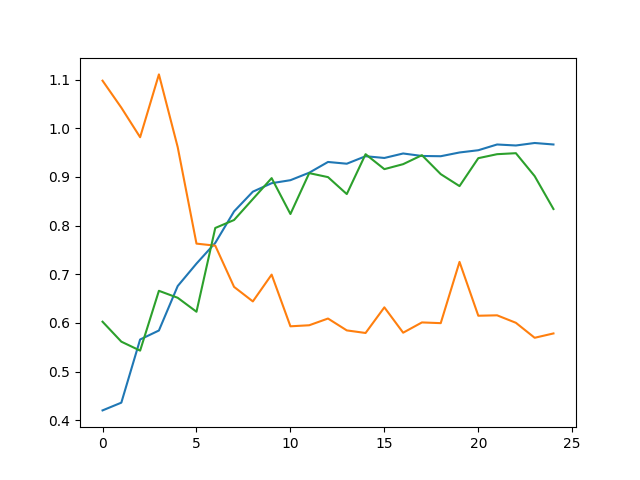

# CNN-Based Student Attention Determination Device in Classroom Settings

This is a project I completed for the "DSE333: Internet of Things" course at the Indian Institute of Science Education and Research Bhopal.

In this project, I created a model that captures images of a classroom and classifies students' attention levels as **High**, **Medium**, or **Low**. I used a 720p camera and a Raspberry Pi to capture the images.

The dataset for training the model was manually collected and labeled by me with three classes:  
- **0**: Low attention  
- **1**: Medium attention  
- **2**: High attention  

## Dataset

The dataset folder is organized as follows:

```

data
|--train
|    |----0
|    |    |----image1.png
|    |    |----image2.png
|    |    |.....
|    |    
|    |----1
|    |    |----image1.png
|    |    |----image2.png
|    |    |.....
|    |    
|    |----2
|         |----image1.png
|         |----image2.png
|         |.....
|    
|--test
|    |----0
|    |    |----image1.png
|    |    |----image2.png
|    |    |.....
|    |    
|    |----1
|    |    |----image1.png
|    |    |----image2.png
|    |    |.....
|    |    
|    |----2
|         |----image1.png
|         |----image2.png
|         |.....    

```

## Training

The `train.py` file can be used for training by executing it directly.

## Deployment

The model can be deployed on a Raspberry Pi and integrated with a seven-segment display to show attention levels. The attention levels are represented as follows:
- **Three lines**: High attention
- **Two lines**: Medium attention
- **One line**: Low attention

The deployment code is provided in the `display.py` file.

For assistance with deployment or any issues, please contact me or raise an issue.

## Model training graph




